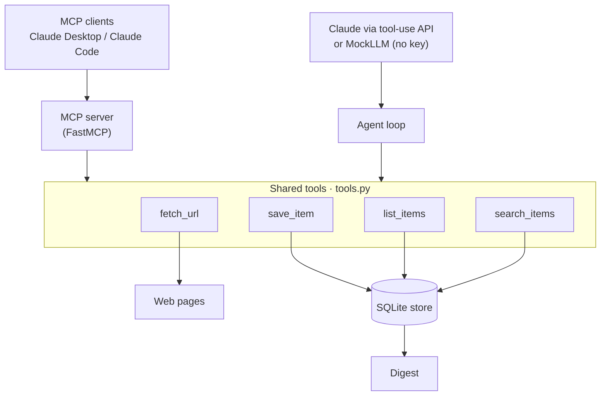
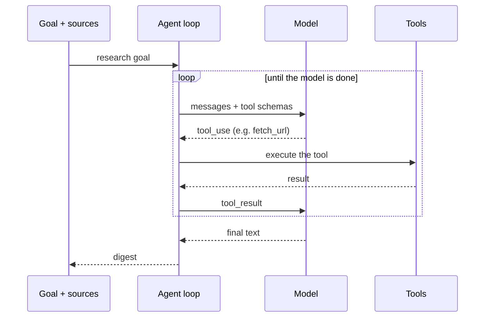

# mcp-research-agent


[](https://github.com/gbadedata/mcp-research-agent/actions/workflows/tests.yml)

A small AI automation that collects information from web sources and turns it into a
digest, built two ways from one set of tools: as an **MCP server** any agent can plug into,
and as a **standalone tool-using Claude agent**. It fetches and parses pages, saves the
notable items to a local database (deduplicated), and writes a short digest.

> **What it demonstrates:** an MCP server exposing real tools, an agent orchestration loop
> over the Anthropic tool-use API, web fetching and parsing, a SQLite store, and a workflow
> that ties them together. The tools and the loop run and are tested with no API key (a
> mock model drives the loop); the live agent runs with your key.

---

## Contents

- [Why this exists](#why-this-exists)
- [Architecture](#architecture)
- [The agent loop](#the-agent-loop)
- [Install](#install)
- [Quick start](#quick-start)
- [Use it as an MCP server](#use-it-as-an-mcp-server)
- [Use it as a standalone agent](#use-it-as-a-standalone-agent)
- [The offline demo](#the-offline-demo)
- [Extending it: add a tool](#extending-it-add-a-tool)
- [An OpenClaw / Claude Code skill](#an-openclaw--claude-code-skill)
- [Design decisions](#design-decisions)
- [Limitations](#limitations)
- [Project structure](#project-structure)
- [Tests](#tests)
- [License](#license)

## Why this exists

Most useful automation is unglamorous plumbing: pull from some sources, keep what matters,
drop duplicates, hand back something readable, and do it again tomorrow without breaking.
The interesting question is how to structure that so it is not throwaway. This project
answers it with one idea: write the tools once, then let them be driven either by a person's
agent client over MCP or by an autonomous loop, and make the whole thing runnable and
testable without spending a single API call. The task here is a research digest, but the
shape is the point.

## Architecture

One set of tools, two front ends, no duplication.



| Module | Responsibility |
|---|---|
| `tools.py` | The tools: `fetch_url` (http(s) and file://), `save_item`, `list_items`, `search_items` |
| `store.py` | SQLite persistence, deduplicated on URL |
| `mcp_server.py` | Exposes the tools over MCP via FastMCP (front end 1) |
| `agent.py` | Anthropic tool-use loop that drives the tools toward a goal (front end 2) |
| `llm.py` | Anthropic client wrapper, and a `MockLLM` so the loop runs with no key |
| `digest.py` | A deterministic, no-LLM digest of what has been collected |
| `cli.py` | `demo`, `run`, `serve`, `digest`, `tools`, `init-db` |

## The agent loop

Given a goal, the agent lets the model call tools and feeds each result back until the model
stops asking for tools and returns a digest. The loop reads only `.stop_reason` and the
content blocks, so it does not know whether it is talking to Claude or the `MockLLM`.



In code, the core is small:

```python
resp = self.llm.complete(system=SYSTEM, messages=messages, tools=TOOL_SCHEMAS)
if resp.stop_reason != "tool_use":
    return {"digest": final_text(resp), ...}          # the model is done
for call in tool_uses(resp):
    result = dispatch[call.name](**call.input)         # run the tool for real
    messages.append(tool_result(call.id, result))      # feed the result back
```

## Install

```bash
pip install -r requirements.txt
```

Requires Python 3.10 or newer (an MCP SDK requirement).

## Quick start

```bash
python -m research_agent.cli tools     # list the tools
python -m research_agent.cli demo      # run the whole loop offline, no API key needed
```

## Use it as an MCP server

Start it over stdio:

```bash
python -m research_agent.cli serve
```

Register it with an MCP-capable client. For Claude Desktop, add to the config:

```json
{
  "mcpServers": {
    "research-agent": {
      "command": "python",
      "args": ["-m", "research_agent.mcp_server"],
      "cwd": "/absolute/path/to/mcp-research-agent"
    }
  }
}
```

The client can then call `fetch_url`, `save_item`, `list_items`, and `search_items`
directly.

## Use it as a standalone agent

With `ANTHROPIC_API_KEY` set, the agent runs the live tool-use loop:

```bash
export ANTHROPIC_API_KEY=sk-...
python -m research_agent.cli run \
  --url https://example.com/page-1 \
  --url https://example.com/page-2
```

It fetches each source, saves the notable items, and prints a digest.

## The offline demo

The loop is provable without a key. A `MockLLM` issues the tool calls, but the fetches and
saves are real, so the digest reflects what was actually collected:

```text
$ python -m research_agent.cli demo
Agent finished in 3 steps, tool calls: ['fetch_url', 'save_item', 'save_item']

Research digest (2 of 2 items):

- MCP adoption grows [Sample Feed] More clients adopt the Model Context Protocol.
  https://example.com/mcp
- Anthropic ships new agent tooling [Sample Feed] New tooling for building agents.
  https://example.com/agents
```

## Extending it: add a tool

Because the tools are shared, a new capability is added in one place and both front ends
gain it:

```python
# 1) implement it in tools.py
def summarise_text(text: str, max_sentences: int = 3) -> dict:
    ...

# 2) expose it over MCP in mcp_server.py
@mcp.tool()
def summarise_text(text: str, max_sentences: int = 3) -> dict:
    return t.summarise_text(text, max_sentences)

# 3) add its schema to TOOL_SCHEMAS and its entry to _dispatch in agent.py
```

The MCP client and the agent both pick it up; nothing else changes.

## An OpenClaw / Claude Code skill

`skills/research-digest/SKILL.md` packages this workflow as a skill following the SKILL.md
convention shared by OpenClaw and Claude Code: metadata and the tools it needs in the front
matter, instructions below. It points at the same MCP tools, so an agent runtime that loads
skills can run the digest workflow with no extra code.

## Design decisions

- **One set of tools, two front ends.** The MCP server and the standalone agent call the
  same functions, so behaviour cannot drift between them, and a new tool lands in both at
  once.
- **Runs with and without a key.** The `MockLLM` makes the whole orchestration testable and
  demonstrable offline; the live path is one class away.
- **Idempotent by design.** Items are deduplicated on URL, so the automation can run on a
  schedule against the same sources without piling up duplicates.
- **A no-LLM path exists.** When a model is not warranted, the deterministic `digest`
  command renders what is stored. Reaching for the simplest thing that works is deliberate.
- **Tool errors do not stop the run.** A failed tool call is passed back to the model as an
  error so it can adapt, rather than crashing the loop.

## Limitations

- **Fetching is simple.** It reads static HTML; it does not render JavaScript. A headless
  browser would be the next step for dynamic pages.
- **The live agent needs an API key** and is not exercised in CI; the offline loop and all
  tools are.
- **The store is local SQLite**, suited to a single-user automation rather than a shared
  service.

## Project structure

```
mcp-research-agent/
├── research_agent/
│   ├── tools.py         # fetch_url, save_item, list_items, search_items
│   ├── store.py         # SQLite, deduplicated on URL
│   ├── mcp_server.py    # FastMCP server (MCP front end)
│   ├── agent.py         # Anthropic tool-use loop (agent front end)
│   ├── llm.py           # Anthropic wrapper + MockLLM
│   ├── digest.py        # deterministic no-LLM digest
│   └── cli.py           # demo, run, serve, digest, tools, init-db
├── skills/research-digest/SKILL.md   # OpenClaw / Claude Code style skill
├── examples/sample_page.html         # used by the offline demo and tests
├── tests/                            # 12 tests: store, tools, agent loop, MCP registration
├── requirements.txt
└── LICENSE
```

## Tests

```bash
python -m pytest -q      # 12 tests
```

They cover the store and its deduplication, the tools (including parsing a real page from a
local fixture), the agent loop end to end with the MockLLM (tool calls, error handling,
max-steps), and that the MCP server registers its tools. Run in CI on Python 3.10, 3.11 and
3.12.

## License

Released under the MIT License. See [LICENSE](LICENSE).
